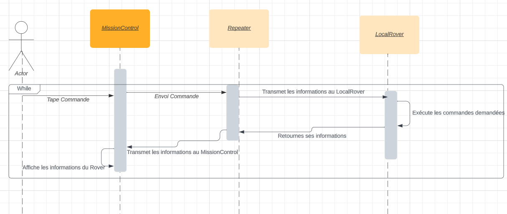
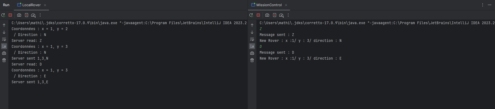
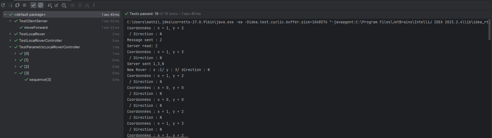

# Mars Rover Project

Bienvenue sur le projet Mars Rover Project du Groupe A.

Cette application à été développé en Java (JDK 17).

Pour rappel, les membres du Groupe A sont :
* Ewen TONNERRE
* Gaetan SALVI
* Joshua ELIEZER-VANEROT
* Nicolas MARY
* Mathieu GRATTARD
* Lucas LACAZE

## Contexte


Un Rover est un Robot mobile conçu pour se déplacer à la surface d'astres éloignés de la Terre et du système.
Ce Rover s'exécute à distance étant donné qu'il peut être envoyé sur une planète sans forcément être accompagné de la présence Humaine.

Dans notre application, Le Rover communique avec un MissionControl qui envoie des commandes dans une console. Le Rover interprètre les commandes reçus par le MissionControl, exécute l'ordre demandé et renvoie sa position après s'être déplacé.

Afin de rendre la compréhension plus claire, il faut savoir que nos planètes sont toroïdales (Des planètes en géométrie 2D. Si le Rover arrive au bout de la Planète, alors il revient de l'autre côté.)

## Fonctionnement de l'application

Notre application fonctionne par communication en Socket. Le Rover est considéré comme le Server et le MissionControl comme client.

En effet, le MissionControl envoie un information (Donc la commande souhaitée) et attends une réponse de la part de Rover. Le Rover attends un ordre de la part du Client, réalise la commande demandée et retourné ses informations au Client pour que le MissionControl mettent à jour la position du Rover.

Les principes d'Architecture Logicielle ont essayé d'être respecté au Maximum afin de répondre aux critères de Notation de notre Intervenant.

Voici un schéma de fonctionnement entre nos différents Main :



## Exécution

Si vous souhaitez testé notre application, vous avez deux possibilités :

* La première, exécuter les deux mains (D'abord celui de LocalRover et ensuite celui de MissionControl)



* La deuxième, simplement exécuter les tests présents dans le package test de notre application. Ils possèdent des tests unitaires pour tester les méthodes de Rover, le retour sur une coordonnée exacte par rapport à une planète ou bien encore tester lorsqu'un Obstacle est en face du Rover



Pour ceux qui ne souhaitent pas ouvrir le projet mais simplement utilisé une commande, vous pouvez exécuter la commande suivante 

```bash
mvn clean install test
```

PS : Pour des raisons de conflits entre les ports, etc. Je vous invite à lancer les tests manuellement depuis un IDE un par un pour la partie Client / Server. En lançant directement la classe, cela provoquera une erreur. 
